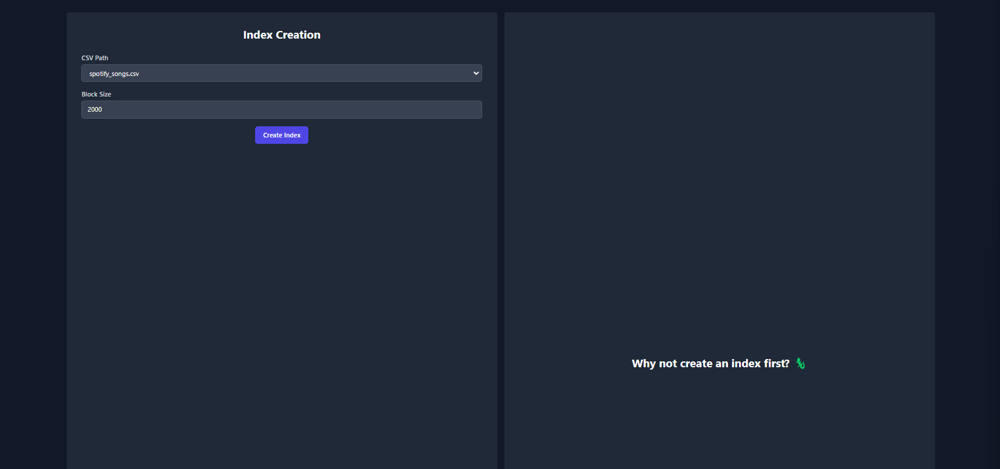
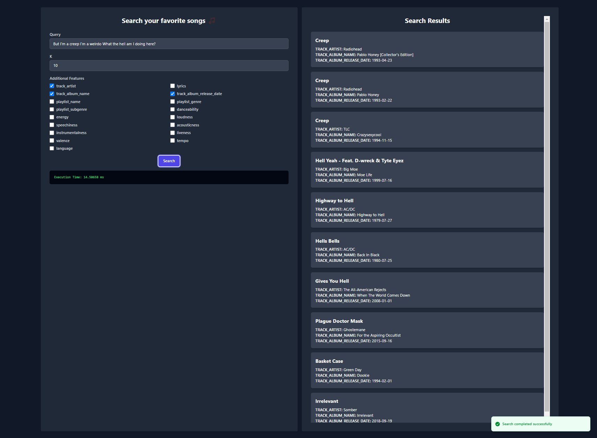

# Proyecto de Base de Datos 2 - Recuperación de Texto utilizando SPIMI INDEX

## Introducción
### Objetivo del Proyecto
El objetivo de este proyecto es implementar un sistema de recuperación de información utilizando un índice invertido basado en el modelo de recuperación por ranking para consultas de texto libre. Esto permite buscar y recuperar documentos relevantes a partir de una consulta en lenguaje natural, optimizando la búsqueda mediante la similitud de coseno y el cálculo de pesos TF-IDF.

### Descripción del Dominio de Datos y la Importancia de Aplicar Indexación
El dataset utilizado proviene de Kaggle y contiene datos sobre canciones de Spotify, incluyendo letras, nombres de pistas, artistas y álbumes. Este contiene 18454 registros. Aplicar técnicas de indexación a estos datos es crucial para mejorar la eficiencia y precisión en la recuperación de información, especialmente cuando se trabaja con grandes volúmenes de datos textuales.

## Backend: Índice Invertido

### Construcción del Índice Invertido en Memoria Secundaria

1. **Inicialización**:
   - Se carga el dataset que contiene las letras de las canciones y los metadatos de las mismas.
   - Se define el tamaño de los bloques, el directorio temporal para almacenar los índices parciales y el archivo final donde se guardará el índice invertido completo.

2. **Preprocesamiento del Texto**:
   - **Tokenización**: Se divide el texto en palabras individuales (tokens).
   - **Eliminación de Stopwords**: Se eliminan las palabras comunes que no aportan significado significativo, tanto en español como en inglés. Tambien se eliminan los signos de puntuación.
   - **Stemming**: Se reduce cada palabra a su raíz, dependiendo del idioma detectado (español o inglés).

3. **Procesamiento en Bloques**:
   - Los documentos se procesan en bloques de un tamaño predefinido.
   - Para cada bloque, se crea un diccionario temporal donde cada término (palabra) se asocia con una lista de documentos en los que aparece junto con su frecuencia de aparición.

4. **Cálculo de Normas de Documentos**:
   - Para cada documento, se calcula la norma (longitud) del documento sumando los cuadrados de las frecuencias de los términos y tomando la raíz cuadrada del resultado.

5. **Almacenamiento Temporal**:
   - Cada bloque procesado se guarda como un archivo temporal en el directorio designado.
   - Los archivos temporales contienen el diccionario de términos y las normas de los documentos correspondientes al bloque.

6. **Fusión de Bloques**:
   - Los archivos temporales se cargan y se fusionan en un solo índice invertido.
   - Se utiliza una estructura de datos de tipo heap para ordenar y combinar las listas de postings de cada término de los diferentes bloques.
   - Las normas de los documentos también se combinan y se recalculan si es necesario.

7. **Índice Final**:
   - El índice invertido final, que contiene los términos, las listas de documentos asociados y las normas de los documentos, se guarda en un archivo en la memoria secundaria.

### Ejecución Óptima de Consultas Aplicando Similitud de Coseno

1. **Preprocesamiento de la Consulta**:
   - La consulta ingresada por el usuario se tokeniza, se eliminan las stopwords y se aplica stemming, siguiendo el mismo proceso que para los documentos.

2. **Cálculo de Pesos TF-IDF para la Consulta**:
   - Se calcula el peso TF-IDF para cada término de la consulta. TF (Term Frequency) es la frecuencia del término en la consulta, e IDF (Inverse Document Frequency) se calcula en función de la cantidad de documentos en los que aparece el término.

3. **Normalización del Vector de la Consulta**:
   - Se calcula la norma del vector de la consulta para normalizar los pesos TF-IDF.

4. **Cálculo de Similitud de Coseno**:
   - Para cada término en la consulta, se busca en el índice invertido los documentos que contienen el término.
   - Se calcula la similitud de coseno entre la consulta y cada documento relevante. Esto se hace multiplicando los pesos TF-IDF del término en la consulta y en el documento, y dividiendo por el producto de las normas de los vectores del documento y la consulta.

5. **Ranking de Documentos**:
   - Los documentos se ordenan en función de la similitud de coseno calculada, de mayor a menor.
   - Se seleccionan los documentos con la mayor similitud para formar el Top-K resultados.

6. **Presentación de Resultados**:
   - Los documentos más relevantes se presentan al usuario, incluyendo información como el nombre de la pista, el artista y la similitud de coseno.
   - Se muestra el tiempo total que tomó procesar la consulta.

Este proceso garantiza que las consultas se ejecuten de manera eficiente y que los documentos más relevantes se recuperen y presenten rápidamente al usuario.

### Índice Invertido en PostgreSQL/MongoDB
#### PostgreSQL
- "COMPLETAR AQUI"

## Frontend

### Diseño de la GUI
La interfaz gráfica de usuario (GUI) permite interactuar con el índice invertido mediante su creación, consulta y presentación de resultados. La GUI se desarrolló utilizando el framework de React.js y se comunica con el servidor backend a través de una API REST.

#### Al crear el indice invertido

- **Carga de Datos**: Permite al usuario cargar un archivo CSV que contiene los datos de las canciones.
- **Selección del número de bloques**: El usuario puede especificar la cantidad de bloques en los que se dividirá el índice invertido.

#### Después de crear el indice invertido

- **Campo de Consulta**: Permite al usuario ingresar una consulta en lenguaje natural.
- **Selección de Top-K**: El usuario puede especificar la cantidad de documentos a recuperar.
- **Presentación de Resultados**: Los resultados se muestran de manera amigable, incluyendo el tiempo de respuesta de la consulta.

### Mini-manual de Usuario

#### Al crear el indice invertido

1. **Cargar Datos**: Haga clic en el botón "Cargar Datos" y seleccione un archivo CSV que contenga los datos de las canciones.
2. **Especificar Bloques**: Ingrese el número de bloques en los que desea dividir el índice invertido.

#### Al realizar una consulta

1. **Ingresar la Consulta**: Escriba la consulta en el campo de texto.
2. **Especificar Top-K**: Seleccione la cantidad de documentos a recuperar.
3. **Seleccion atributos extra**: Seleccione los atributos extra que desea mostrar en los resultados.
4. **Ver Resultados**: Los resultados aparecerán en la pantalla, mostrando la información relevante de las canciones junto con la similitud de coseno y el tiempo de consulta.

### Screenshots de la GUI

#### Creación del Índice Invertido


#### Consulta de Texto Libre


### Análisis Comparativo Visual con Otras Implementaciones
Comparación visual del rendimiento y precisión entre la implementación propia y las realizadas con PostgreSQL.

## Experimentación

### Tablas y Gráficos de los Resultados Experimentales
Se realizaron pruebas con diferentes tamaños de dataset (N = 1000, 2000, 4000, 8000, 16000, 25000). A continuación se presentan las tablas y gráficos con los resultados obtenidos.

#### Tiempo de Creación del Índice Invertido

| N     | SPIMI INDEX Time (ms) | PostgreSQL Time (ms) |
|-------|-----------------------|----------------------|
| 1000  | 0              | 0                    |
| 2000  |  0            | 0                |
| 4000  | 0             | 0                 |
| 8000  | 0              | 0                |
| 16000 | 0               | 0                 |
| 25000 | 0               | 0                |

#### Tiempo de Ejecución de Consultas (Top-K = 10)

| N     | SPIMI INDEX Time (ms) | PostgreSQL Time (ms) |
|-------|-----------------------|----------------------|
| 1000  |  0                | 0                 |
| 2000  |  0                | 0                |
| 4000  | 0             | 0                 |
| 8000  | 0              | 0                |
| 16000 | 0               | 0                 |
| 25000 | 0               | 0                |

### Análisis y Discusión
(COMPLETAR AQUI)

## Ejecución del Proyecto

### Backend
Para ejecutar el servidor backend, debe crear un entorno virtual e instalar las dependencias desde el archivo `requirements.txt`. Luego, ejecute el servidor con el siguiente comando:

```bash
cd backend
python3 -m venv venv
source venv/bin/activate
pip install -r requirements.txt
fastapi dev api.py
```

### Frontend
Para ejecutar el servidor frontend, debe instalar los módulos de Node.js y luego ejecutar el servidor con el siguiente comando:

```bash
cd frontend
npm install
npm run dev
```

## Autores

| **Benjamin Soto** | **Edgar Chambilla** | **Fabrizzio Vilchez** | **Ian Gonzales** | **Jeffrey Monja** |
|:------------:|:------------:|:------------:|:------------:|:------------:|
|  |  |  |  |  |
| [https://github.com/SotoBenjamin](https://github.com/SotoBenjamin) | [https://github.com/Edgar5377](https://github.com/Edgar5377) | [https://github.com/Fabrizzio20k](https://github.com/Fabrizzio20k) | [https://github.com/mukanjy0](https://github.com/mukanjy0) | [https://github.com/jeffreymonjacastro](https://github.com/jeffreymonjacastro) |
